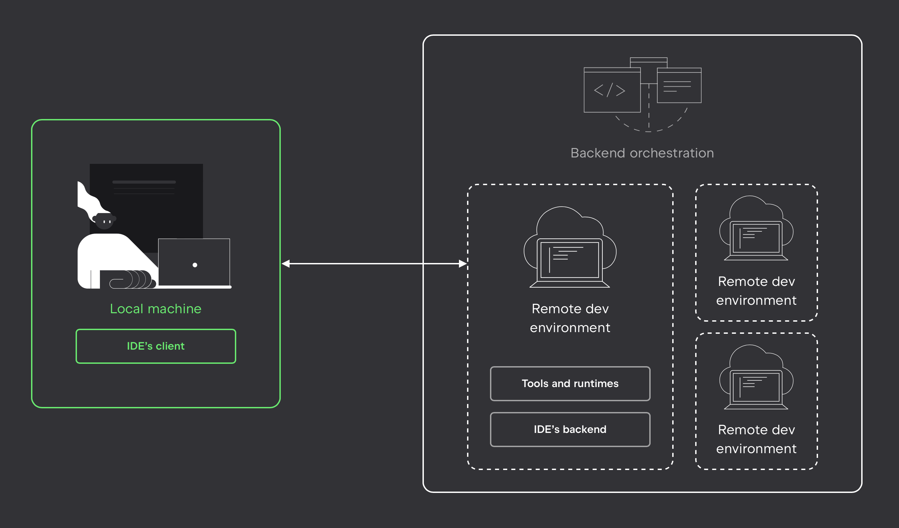

This online course offers the ability to learn remotely without the hassle of setting up and configuring their environment on their own computer.

When you open a course, our service automatically creates a dedicated cloud environment just for you. This environment runs in the cloud as a container, pre-configured with everything needed for the course — the latest version of the IDE, course materials, and a set of essential tools (such as the required libraries, plugins, and system dependencies).

At the same time, JetBrains Toolbox launches on your computer, preparing and running the client-side of the IDE, and establishing a connection to the cloud environment.

This way, you can learn even on relatively low-powered computers, as all the heavy computations are handled in the cloud on machines with guaranteed adequate resources, including GPU. All progress is also saved on our servers, allowing you to start learning on one device and continue seamlessly on another.
