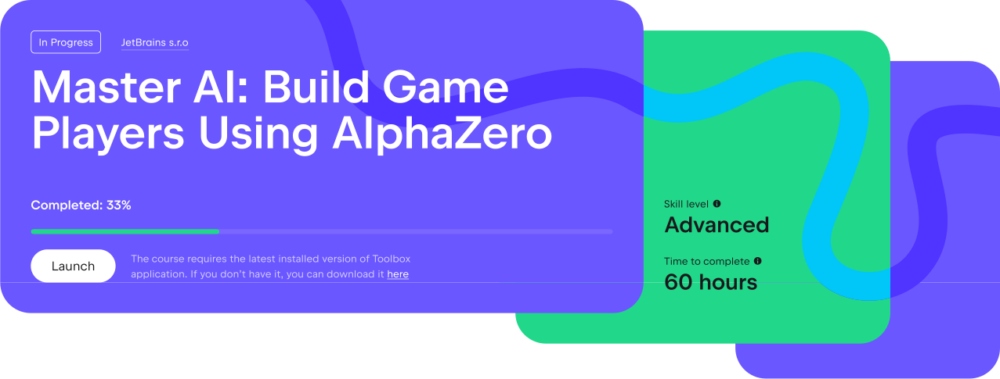
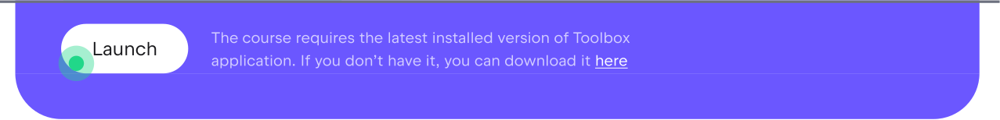
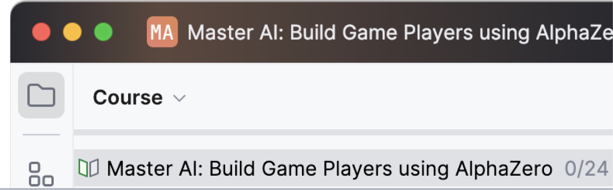

We have attempted to make working with the course as comfortable as possible and for this purpose we have collected all necessary information on the [course web page](https://academy.jetbrains.com/course/build-games-with-ai-and-alphazero). You can view your progress on the course, run the course in the IDE, and check the status of your trial license.

You can close the IDE and return to the course at any time. To do this, go to [the course page](https://academy.jetbrains.com/course/build-games-with-ai-and-alphazero) and click the _Launch_ button.

As you complete tasks, your progress bar will grow and be stored on a server.

You can see your progress right in the IDE above the assignment list or on the course page after logging in.

